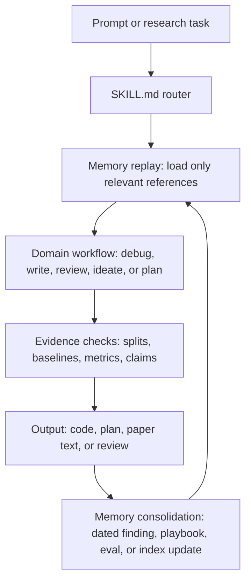
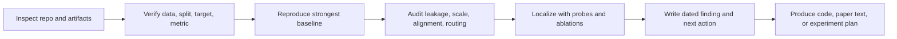
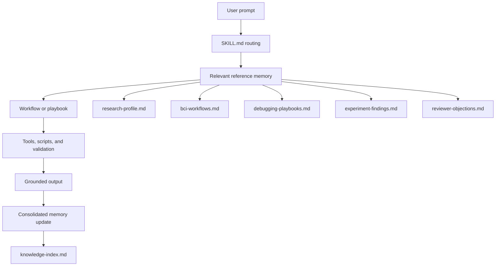

<div align="center">
  <a href="https://github.com/dongyangli-del/NeuroFlow-Agent">
    
  </a>

  <p>
    <b>A persistent workflow system for rigorous AI x BCI research agents.</b><br>
    Custom workflows, research memory, debugging playbooks, and reviewer-facing procedures for EEG decoding, neural reconstruction, brain-language alignment, and closed-loop NeuroAI.
  </p>

  <p>
    <a href="https://github.com/dongyangli-del/NeuroFlow-Agent/stargazers"></a>
    <a href="https://github.com/dongyangli-del/NeuroFlow-Agent/forks"></a>
    <a href="https://github.com/dongyangli-del/NeuroFlow-Agent/commits/main"></a>
    <a href="https://github.com/dongyangli-del/NeuroFlow-Agent/issues"></a>
  </p>

  <p>
    <a href="README_CN.md"></a>
    <a href="docs/WORKFLOWS.md"></a>
    <a href="docs/PLAYBOOKS.md"></a>
    <a href="docs/VALIDATION.md"></a>
  </p>
</div>

---

## Core Thesis

An agent has three practical components: the model, the tools, and the workflow. In AI x BCI and neuroscience research, the model and tools are increasingly shared infrastructure. The workflow is the part that must be customized for a vertical domain, because it encodes what to inspect first, which failure modes are unacceptable, how evidence becomes a claim, and how useful experience survives across sessions.

This repository is built around that thesis. Its goal is not to publish a small prompt pack or a generic AI x BCI skill. The goal is to build a persistent research workflow system with self-evolution, memory replay, and memory consolidation: every inspected paper, repository, experiment failure, reviewer objection, and debugging procedure should make later agents more reliable.

## What It Is

`ai-bci-research` is a specialized Codex skill that turns an agent into a more reliable collaborator for AI x brain-computer interface research.

It is not a generic neuroscience note dump. It is an opinionated operating layer for fragile research work where split leakage, target normalization, feature alignment, stochastic generation, and reviewer-facing claims can silently break conclusions.

| Use it for | What the skill makes the agent do |
|---|---|
| EEG diffusion/debugging | Check scale, sampling variance, condition use, train/val/test localization, and evaluator parity before blaming model capacity. |
| Neural decoding/reconstruction | Audit splits, repetition handling, stimulus identity, baselines, metrics, and noise ceilings. |
| Paper writing/rebuttal | Convert claims into reviewer-facing, evidence-scoped scientific writing. |
| Experiment memory | Distill raw logs into dated findings, playbooks, acceptance criteria, and next probes. |
| Closed-loop BCI planning | Separate offline replay from online claims and surface safety, calibration, latency, and controls. |

## Why Workflow Is the Vertical Layer

For this project, "workflow" means more than a checklist. It is the durable execution policy that decides how an agent should read context, inspect code, run diagnostics, update memory, and turn results into paper-facing claims.

| Agent component | What is usually shared | What this repo customizes |
|---|---|---|
| Model | General reasoning, coding, writing, and multimodal capability. | Domain-specific caution about neural decoding, reconstruction, closed-loop claims, and reviewer evidence. |
| Tools | Shell, Python, Git, search, plotting, validation, and document utilities. | Small deterministic scripts for repo inventory, knowledge indexing, and skill validation. |
| Workflow | Generic task decomposition and tool use. | AI x BCI research loops, memory replay, experiment consolidation, leakage audits, baseline checks, and claim discipline. |

The central artifact is therefore not a single `SKILL.md` file. `SKILL.md` is only the router. The durable system lives across references, docs, evals, and scripts that together control how the agent learns from repeated research work.

## Quick Start

Install with the Codex skill installer:

```bash
python3 ~/.codex/skills/.system/skill-installer/scripts/install-skill-from-github.py \
  --repo dongyangli-del/NeuroFlow-Agent \
  --path skills/ai-bci-research
```

Or install manually:

```bash
git clone https://github.com/dongyangli-del/NeuroFlow-Agent.git
cd NeuroFlow-Agent
bash install.sh
```

Restart Codex after installation.

Then ask Codex with the skill name:

```text
Use ai-bci-research to debug why my EEG diffusion model is far below the linear baseline.
```

```text
Use ai-bci-research to design ablations for an EEG-guided visual reconstruction paper.
```

```text
Use ai-bci-research to turn these experiment logs into reviewer-facing claims and limitations.
```

## Persistent Workflow System

The repository is organized as a compact operating system for research agents:



This loop is designed to become more useful over time. New experience should be distilled into reusable memory rather than left as a one-off chat transcript.

## The BCI-RIGOR Loop

The core workflow is `BCI-RIGOR`: a repeatable loop for research-grade AI x BCI work.



This loop is intentionally conservative: surprising results are treated as possible protocol or implementation bugs until the checks are exhausted.

## Why AI x BCI Needs a Workflow System

General-purpose agents often miss domain-specific failure modes:

- EEG repetitions, session splits, subject splits, and stimulus identities can leak silently.
- DNN features and EEG targets can be off by one image, layer, token format, or split order.
- Generated EEG can have plausible correlation but broken explained variance due to scale errors.
- Epsilon diffusion can learn denoising shortcuts while weakly using image-specific condition tokens.
- Reconstruction and closed-loop papers require precise claim boundaries and reviewer-ready baselines.

This workflow system packages those guardrails so future sessions begin with the right defaults.

## Architecture



The design uses progressive disclosure: `SKILL.md` stays compact, and detailed knowledge lives in references that are loaded only when needed.

## Repository Layout

```text
skills/ai-bci-research/
├── SKILL.md                         # compact routing and operating workflow
├── agents/openai.yaml               # UI metadata
├── evals/evals.json                 # behavior checks for the skill
├── references/
│   ├── research-profile.md          # mission, scope, and guardrails
│   ├── bci-workflows.md             # decoding/reconstruction/closed-loop checklists
│   ├── debugging-playbooks.md       # reusable failure-mode diagnostics
│   ├── experiment-findings.md       # compact dated experiment conclusions
│   ├── experiment-log-template.md   # reproducibility template
│   ├── papers-index.md              # user paper map and positioning
│   ├── repositories.md              # local/public repo memory
│   ├── reviewer-objections.md       # review risk and rebuttal patterns
│   ├── venue-workflows.md           # conference workflow guidance
│   ├── writing-style.md             # preferred scientific style
│   └── knowledge-index.md           # generated reference index
└── scripts/
    ├── repo_inventory.py
    └── update_knowledge_index.py
```

Project-level docs:

| File | Purpose |
|---|---|
| [docs/WORKFLOWS.md](docs/WORKFLOWS.md) | Named research loops and operating procedures. |
| [docs/PLAYBOOKS.md](docs/PLAYBOOKS.md) | Catalog of detailed references and when to load them. |
| [docs/EXAMPLES.md](docs/EXAMPLES.md) | Demo-case template and planned real examples. |
| [docs/VALIDATION.md](docs/VALIDATION.md) | Local checks and validation expectations. |
| [CONTRIBUTING.md](CONTRIBUTING.md) | Rules for adding durable skill memory. |
| [README_CN.md](README_CN.md) | Chinese project overview. |

## Content Organization Principle

Keep the repo organized by how memory is used, not by where it came from:

- `SKILL.md`: routing, first reads, and high-level operating rules only.
- `references/`: consolidated research memory that should change future agent behavior.
- `docs/`: public-facing explanation of workflows, playbooks, examples, and validation.
- `scripts/`: deterministic maintenance utilities, not research experiments.
- `evals/`: behavioral tests that prevent regression in agent conduct.

Raw logs, large artifacts, datasets, checkpoints, and private human-subject material should stay outside this repository. Only the durable lesson belongs here.

## Current Playbooks

| Playbook | When it matters |
|---|---|
| EEG diffusion underperforms regression | Generated EEG has wrong scale or collapses despite low denoising loss. |
| Output directory routing bug | Fixed experiments accidentally write to stale directories. |
| EEG diffusion vs linear baseline large gap | Need to separate evaluator bugs, sampling variance, condition use, and architecture issues. |
| Conditional EEG diffusion objective mismatch | Epsilon DDPM weakly uses image condition; x0/direct predictors become the next required probe. |

## Validation

Run local validation before committing changes:

```bash
make validate
```

The validator checks required files, `SKILL.md` frontmatter, eval JSON syntax, local Markdown links, and accidental large files.

When reference files change, rebuild the compact index:

```bash
make index
make validate
```

A GitHub Actions workflow template is provided at [docs/ci-validate.yml](docs/ci-validate.yml). Copy it to `.github/workflows/validate.yml` when pushing with a token that has GitHub `workflow` scope.

## Demo Cases

Real demos should come from inspected artifacts or user-approved summaries. They are intentionally not fabricated here.

Planned demo slots:

- EEG diffusion scale/normalization failure.
- EEG diffusion objective mismatch and weak condition use.
- Reviewer-facing paper audit for leakage, baselines, and metric validity.

Use [docs/EXAMPLES.md](docs/EXAMPLES.md) to add a demo once the underlying artifact is ready.

## Update Workflow

After adding papers, repository notes, datasets, or experiment findings:

```bash
cd NeuroFlow-Agent/skills/ai-bci-research
python3 scripts/update_knowledge_index.py --root .
cd ../..
make validate
```

Keep raw logs, checkpoints, private data, and large generated outputs outside this repository.

## Roadmap

- Add real, inspected demo cases for EEG diffusion debugging and paper audit workflows.
- Add an explicit memory replay and consolidation protocol for repeated experiment sessions.
- Expand self-evolution rules: when a new failure mode becomes a playbook, eval, or profile update.
- Expand eval prompts for experiment debugging, rebuttal, and closed-loop BCI planning.
- Add schema checks for `agents/openai.yaml` and eval structure.
- Publish a compact technical note explaining why workflow, not only model or tool choice, is the vertical layer for AI x BCI agents.
- Keep the project narrow and deep: the best persistent workflow system for AI x BCI research agents.

## Quality Bar

A change improves the project only if it makes future agents more reliable. Prefer concise playbooks, dated findings, explicit acceptance criteria, verified project facts, replayable workflows, and eval prompts over broad notes or invented examples.
