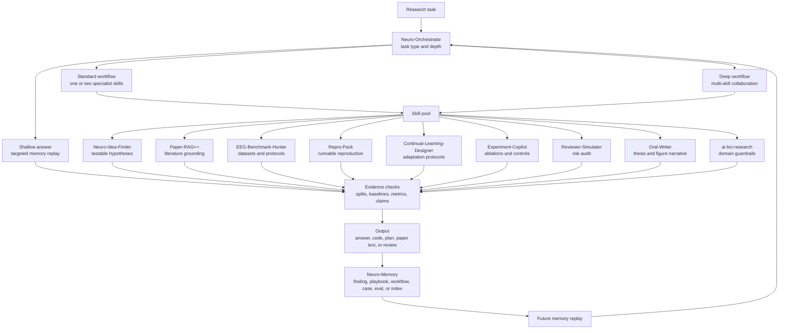
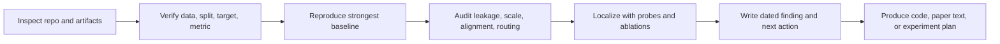

<div align="center">
  <a href="https://github.com/dongyangli-del/NeuroFlow-Agent">
    
  </a>

  <p>
    <b>A self-evolving workflow system for AI x BCI and NeuroAI research agents.</b><br>
    Multi-skill orchestration, persistent research memory, task-depth routing, debugging playbooks, and reviewer-facing procedures for neural decoding, reconstruction, brain-language alignment, and closed-loop NeuroAI.
  </p>

  <p>
    
    
    
    
  </p>

  <p>
    <a href="README_CN.md"></a>
    <a href="docs/WORKFLOWS.md"></a>
    <a href="docs/PLAYBOOKS.md"></a>
    <a href="docs/VALIDATION.md"></a>
  </p>
</div>

---

## Core Thesis

An agent has three practical components: the model, the tools, and the workflow. In AI x BCI and neuroscience research, the model and tools are increasingly shared infrastructure. The workflow is the vertical layer: it decides which context to replay, which specialist skill should act, how deep the task should go, which validity checks are non-negotiable, how evidence becomes a claim, and what should persist after the session.

This repository is built around that thesis. Its goal is not to publish a small prompt pack or a single generic AI x BCI skill. The goal is to build a self-evolving research workflow system: every inspected paper, repository, experiment failure, reviewer objection, and debugging procedure should be compressed into reusable memory that makes later agents more reliable.

## What It Is

NeuroFlow-Agent is a compact operating layer for rigorous research agents. It combines a multi-skill workflow controller with domain-specific AI x BCI guardrails, literature grounding, experiment planning, reviewer simulation, and memory consolidation.

It is not a generic neuroscience note dump. It is an opinionated workflow system for fragile research work where split leakage, target normalization, feature alignment, stochastic generation, weak baselines, and overclaimed paper text can silently break conclusions.

| Use it for | What the workflow makes the agent do |
|---|---|
| Fast questions | Replay only the relevant memory and return a scoped answer without loading the full system. |
| Literature and positioning | Use paper memory and claim-to-citation mapping before drafting novelty or related work. |
| Experiment design | Build ablations, controls, metrics, statistics, stop rules, and reproducibility checks. |
| Debugging and reproduction | Check scale, sampling variance, condition use, split localization, output routing, and evaluator parity before changing model capacity. |
| Paper writing and rebuttal | Convert claims into reviewer-facing, evidence-scoped scientific writing. |
| Long research sessions | Coordinate multiple skills, consolidate reusable findings, and update the memory/index/eval layer. |
| Closed-loop BCI planning | Separate offline replay from online claims and surface safety, calibration, latency, and controls. |

## Multi-Skill Collaboration

The repository contains several skills that cooperate instead of forcing every task through one large prompt. Each skill has a distinct trigger, first-read set, check order, and output style.

| Skill | Role |
|---|---|
| `neuro-orchestrator` | Routes tasks, controls session depth, and coordinates specialist skills. |
| `neuro-idea-finder` | Generates testable EEG/iEEG/fMRI/MEG/LFP/spike/BCI research ideas. |
| `paper-rag-plus` | Grounds claims in papers, maps claims to citations, and organizes related work. |
| `eeg-benchmark-hunter` | Finds and audits open benchmarks, access, licenses, splits, baselines, metrics, and leakage risks. |
| `repro-pack` | Builds reproduction contracts with environment, data, weights, commands, expected outputs, and recovery paths. |
| `continual-learning-designer` | Designs cross-subject/session/device adaptation, streaming calibration, and forgetting protocols. |
| `experiment-copilot` | Designs experiment matrices, ablations, controls, statistics, and stop rules. |
| `reviewer-simulator` | Audits papers, claims, and rebuttals as a strict conference reviewer. |
| `oral-writer` | Turns evidence into oral-level thesis, figure narrative, and reviewer-facing paper text. |
| `neuro-memory` | Compresses completed sessions into durable workflow, playbook, finding, case, or eval memory. |
| `ai-bci-research` | Supplies shared AI x BCI assumptions, failure-mode checks, and public workflow memory. |

The orchestrator can answer shallow tasks with one skill, route medium tasks through one or two specialists, or run deep tasks through literature grounding, experiment design, review simulation, and memory consolidation.

## Task Depths

NeuroFlow is designed for tasks with different scope and depth:

| Depth | Example task | Expected behavior |
|---|---|---|
| Shallow | "Explain this metric gap." | Load the smallest relevant memory, identify likely failure modes, and give a concise next check. |
| Standard | "Design ablations for this EEG reconstruction model." | Use domain guardrails plus experiment planning to produce a reproducible matrix. |
| Deep | "Prepare this project for a conference submission." | Coordinate literature, experiments, claims, reviewer objections, writing, and limitations. |
| Persistent | "Turn this debugging session into reusable knowledge." | Compress the lesson into a finding, playbook, workflow rule, eval, or index update. |

## Why Workflow Is the Vertical Layer

For this project, "workflow" means more than a checklist. It is the durable execution policy that decides how an agent should read context, inspect code, run diagnostics, update memory, and turn results into paper-facing claims.

| Agent component | What is usually shared | What this repo customizes |
|---|---|---|
| Model | General reasoning, coding, writing, and multimodal capability. | Domain-specific caution about neural decoding, reconstruction, closed-loop claims, and reviewer evidence. |
| Tools | Shell, Python, Git, search, plotting, validation, and document utilities. | Small deterministic scripts for repo inventory, knowledge indexing, and skill validation. |
| Workflow | Generic task decomposition and tool use. | AI x BCI research loops, memory replay, experiment consolidation, leakage audits, baseline checks, and claim discipline. |

The central artifact is therefore not a single `SKILL.md` file. `SKILL.md` is only the router. The durable system lives across references, docs, evals, and scripts that together control how the agent learns from repeated research work.

## Quick Start

Install the full NeuroFlow skill library:

```bash
git clone https://github.com/dongyangli-del/NeuroFlow-Agent.git
cd NeuroFlow-Agent
bash install.sh
```

The installer links every skill under `skills/` into your Codex skills directory. Restart Codex after installation.

To install a single skill with the Codex skill installer, pass its path explicitly:

```bash
python3 ~/.codex/skills/.system/skill-installer/scripts/install-skill-from-github.py \
  --repo dongyangli-del/NeuroFlow-Agent \
  --path skills/neuro-orchestrator
```

Then ask Codex with the skill name:

```text
Use neuro-orchestrator to turn this EEG reconstruction idea into a paper-ready experiment plan.
```

```text
Use eeg-benchmark-hunter to audit candidate open benchmarks for this BCI claim.
```

```text
Use oral-writer to turn these results into an oral-level thesis and figure narrative.
```

## Persistent Workflow System

The repository is organized as a compact operating system for research agents:



This loop is designed to become more useful over time. New experience should be distilled into reusable memory rather than left as a one-off chat transcript.

## The BCI-RIGOR Loop

The core workflow is `BCI-RIGOR`: a repeatable loop for research-grade AI x BCI work.



This loop is intentionally conservative: surprising results are treated as possible protocol or implementation bugs until the checks are exhausted.

## Why AI x BCI Needs a Workflow System

General-purpose agents often miss domain-specific failure modes:

- EEG repetitions, session splits, subject splits, and stimulus identities can leak silently.
- DNN features and EEG targets can be off by one image, layer, token format, or split order.
- Generated EEG can have plausible correlation but broken explained variance due to scale errors.
- Epsilon diffusion can learn denoising shortcuts while weakly using image-specific condition tokens.
- Reconstruction and closed-loop papers require precise claim boundaries and reviewer-ready baselines.

This workflow system packages those guardrails so future sessions begin with the right defaults.

## Architecture

```mermaid
flowchart TD
    accTitle: NeuroFlow Architecture
    accDescr: The architecture separates orchestration, specialist skills, shared domain memory, deterministic maintenance scripts, validation, and self-evolution.

    user[User prompt] --> orchestrator[neuro-orchestrator]
    orchestrator --> depth[Task-depth policy<br/>shallow, standard, deep, persistent]
    depth --> specialists[Specialist skills]

    specialists --> paper[paper-rag-plus]
    specialists --> idea[neuro-idea-finder]
    specialists --> benchmark[eeg-benchmark-hunter]
    specialists --> repro[repro-pack]
    specialists --> continual[continual-learning-designer]
    specialists --> exp[experiment-copilot]
    specialists --> reviewer[reviewer-simulator]
    specialists --> oral[oral-writer]
    specialists --> memory_skill[neuro-memory]
    specialists --> shared[ai-bci-research]

    shared --> refs[Reference memory]
    refs --> profile[research-profile.md]
    refs --> workflows[bci-workflows.md]
    refs --> debugging[debugging-playbooks.md]
    refs --> findings[experiment-findings.md]
    refs --> objections[reviewer-objections.md]
    refs --> style[writing-style.md]

    paper --> grounded[Grounded research output]
    idea --> grounded
    benchmark --> grounded
    repro --> grounded
    continual --> grounded
    exp --> grounded
    reviewer --> grounded
    oral --> grounded
    shared --> grounded

    grounded --> consolidate[Consolidation decision]
    consolidate --> durable[Durable memory update]
    durable --> index[knowledge-index.md]
    durable --> evals[evals.json]
    durable --> validation[make validate]
```

The design uses progressive disclosure: `SKILL.md` stays compact, and detailed knowledge lives in references that are loaded only when needed.

## Repository Layout

```text
skills/ai-bci-research/
├── SKILL.md                         # compact routing and operating workflow
├── agents/openai.yaml               # UI metadata
├── evals/evals.json                 # behavior checks for the skill
├── references/
│   ├── research-profile.md          # mission, scope, and guardrails
│   ├── bci-workflows.md             # decoding/reconstruction/closed-loop checklists
│   ├── debugging-playbooks.md       # reusable failure-mode diagnostics
│   ├── experiment-findings.md       # compact dated experiment conclusions
│   ├── experiment-log-template.md   # reproducibility template
│   ├── papers-index.md              # user paper map and positioning
│   ├── repositories.md              # local/public repo memory
│   ├── reviewer-objections.md       # review risk and rebuttal patterns
│   ├── venue-workflows.md           # conference workflow guidance
│   ├── writing-style.md             # preferred scientific style
│   └── knowledge-index.md           # generated reference index
└── scripts/
    ├── repo_inventory.py
    └── update_knowledge_index.py
```

Project-level docs:

| File | Purpose |
|---|---|
| [docs/WORKFLOWS.md](docs/WORKFLOWS.md) | Named research loops and operating procedures. |
| [docs/PLAYBOOKS.md](docs/PLAYBOOKS.md) | Catalog of detailed references and when to load them. |
| [docs/SKILL_LIBRARY_SPEC.md](docs/SKILL_LIBRARY_SPEC.md) | Full 10-skill library gap analysis, contracts, task chains, and phase criteria. |
| [docs/EXAMPLES.md](docs/EXAMPLES.md) | Demo-case template and planned real examples. |
| [docs/VALIDATION.md](docs/VALIDATION.md) | Local checks and validation expectations. |
| [docs/PUBLIC_READY.md](docs/PUBLIC_READY.md) | Public-release checklist and private-memory policy. |
| [CONTRIBUTING.md](CONTRIBUTING.md) | Rules for adding durable skill memory. |
| [README_CN.md](README_CN.md) | Chinese project overview. |

## Content Organization Principle

Keep the repo organized by how memory is used, not by where it came from:

- `SKILL.md`: routing, first reads, and high-level operating rules only.
- `references/`: consolidated research memory that should change future agent behavior.
- `docs/`: public-facing explanation of workflows, playbooks, examples, and validation.
- `scripts/`: deterministic maintenance utilities, not research experiments.
- `evals/`: behavioral tests that prevent regression in agent conduct.

Raw logs, large artifacts, datasets, checkpoints, and private human-subject material should stay outside this repository. Only the durable lesson belongs here.

## Current Playbooks

| Playbook | When it matters |
|---|---|
| EEG diffusion underperforms regression | Generated EEG has wrong scale or collapses despite low denoising loss. |
| Output directory routing bug | Fixed experiments accidentally write to stale directories. |
| EEG diffusion vs linear baseline large gap | Need to separate evaluator bugs, sampling variance, condition use, and architecture issues. |
| Conditional EEG diffusion objective mismatch | Epsilon DDPM weakly uses image condition; x0/direct predictors become the next required probe. |

## Validation

Run local validation before committing changes:

```bash
make validate
```

The validator checks required files, `SKILL.md` frontmatter, eval JSON syntax, local Markdown links, and accidental large files.

When reference files change, rebuild the compact index:

```bash
make index
make validate
```

A GitHub Actions workflow template is provided at [docs/ci-validate.yml](docs/ci-validate.yml). Copy it to `.github/workflows/validate.yml` when pushing with a token that has GitHub `workflow` scope.

## Demo Cases

Real demos should come from inspected artifacts or user-approved summaries. They are intentionally not fabricated here.

Planned demo slots:

- EEG diffusion scale/normalization failure.
- EEG diffusion objective mismatch and weak condition use.
- Reviewer-facing paper audit for leakage, baselines, and metric validity.

Use [docs/EXAMPLES.md](docs/EXAMPLES.md) to add a demo once the underlying artifact is ready.

## Update Workflow

After adding papers, repository notes, datasets, or experiment findings:

```bash
cd NeuroFlow-Agent/skills/ai-bci-research
python3 scripts/update_knowledge_index.py --root .
cd ../..
make validate
```

Keep raw logs, checkpoints, private data, and large generated outputs outside this repository.

## Roadmap

- Add real, inspected demo cases for EEG diffusion debugging and paper audit workflows.
- Expand task-depth routing evals so shallow, standard, deep, and persistent tasks trigger different memory and skill budgets.
- Strengthen multi-skill collaboration rules across the full 10-skill library.
- Expand self-evolution rules: when a new failure mode becomes a finding, playbook, workflow, eval, or profile update.
- Expand eval prompts for orchestration, experiment debugging, rebuttal, and closed-loop BCI planning.
- Add schema checks for `agents/openai.yaml` and eval structure.
- Publish a compact technical note explaining why workflow, not only model or tool choice, is the vertical layer for AI x BCI agents.
- Keep the project narrow and deep: the best persistent workflow system for AI x BCI research agents.

## Quality Bar

A change improves the project only if it makes future agents more reliable. Prefer concise playbooks, dated findings, explicit acceptance criteria, verified project facts, replayable workflows, and eval prompts over broad notes or invented examples.
