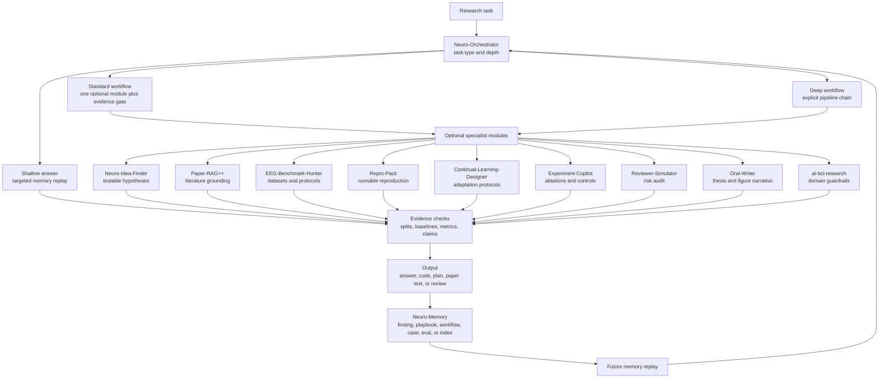
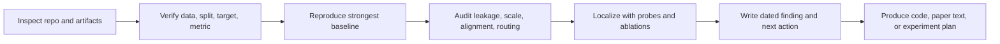
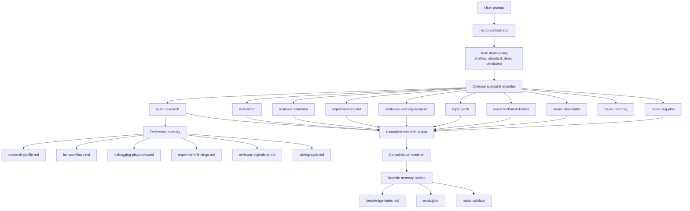

<div align="center">
  <a href="https://github.com/dongyangli-del/NeuroFlow-Agent">
    
  </a>

  <p>
    <b>A vertical agent workflow system for AI x brain, behavior, cognition, and embodied intelligence research.</b><br>
    NeuroFlow-Agent turns frontier AI methods and models into explicit research workflows for neural encoding, decoding, analysis, representation, modulation, cognitive science, psychology, brain-inspired algorithms, and embodied AI.
  </p>

  <p>
    
    
    
    
  </p>

  <p>
    <a href="README_CN.md"></a>
    <a href="docs/WORKFLOWS.md"></a>
    <a href="docs/PLAYBOOKS.md"></a>
    <a href="docs/DEMO_GALLERY.md"></a>
    <a href="docs/TROUBLESHOOTING.md"></a>
    <a href="docs/VALIDATION.md"></a>
  </p>
</div>

---

## Core Thesis: Workflow Is the Vertical Layer

An agent has three practical components: the model, the tools, and the workflow. Models and tools are increasingly shared infrastructure. The vertical layer is the workflow: the domain-specific execution policy that decides which context to replay, which evidence gates are non-negotiable, how deep the task should go, how a result becomes a claim, and what should persist after the session.

NeuroFlow-Agent is built around that thesis. It is not a prompt pack, a generic neuroscience note dump, or a collection of narrow downstream-task helpers. It is a vertical agent workflow system for research at the intersection of AI, brain data, behavior, cognition, psychology, BCI, NeuroAI, brain-inspired algorithms, and embodied intelligence.

The system is designed to make frontier AI methods usable in fragile scientific settings: multimodal large language models, generative models, representation learning, foundation models, agents, continual learning, reinforcement learning, world models, and embodied AI should be routed through rigorous research workflows before they become experiments, papers, claims, or memory.

## What NeuroFlow-Agent Is

NeuroFlow-Agent is a compact operating layer for rigorous AI x brain research agents. It uses `neuro-orchestrator` as the single default workflow entry point, then selects optional specialist modules for literature grounding, benchmark auditing, reproduction, experiment design, reviewer simulation, writing, and durable memory.

The project covers a broad research surface:

| Research surface | What NeuroFlow controls |
|---|---|
| Neural encoding | Stimulus-to-brain modeling, feature alignment, encoding metrics, and baseline parity. |
| Neural decoding | Brain-to-label, brain-to-language, brain-to-image, and brain-to-action decoding with leakage checks. |
| Neural data analysis | EEG/iEEG/fMRI/MEG/LFP/spike preprocessing assumptions, split validity, statistics, and reproducibility. |
| Representation learning | Brain-language, brain-vision, multimodal, latent-space, and mechanistic representation alignment. |
| Modulation and closed-loop BCI | Offline/online boundaries, safety, calibration, latency, feedback, and human-subject constraints. |
| Behavior, cognition, and psychology | Behavioral signals, cognitive variables, task design, interpretation boundaries, and causal caution. |
| Brain-inspired algorithms | Inductive biases, learning rules, memory, attention, adaptation, and biologically motivated architectures. |
| Embodied AI and physical agents | Perception-action loops, world models, multimodal grounding, and closed-loop interaction claims. |
| Frontier AI methods | MLLMs, generative models, diffusion, foundation models, agents, RL, continual learning, and test-time adaptation. |

NeuroFlow does not treat these as isolated downstream tasks. It treats them as connected research workflows where data assumptions, model assumptions, experimental evidence, reviewer risk, and long-term memory have to stay aligned.

| Use it for | What the workflow makes the agent do |
|---|---|
| Scientific triage | Replay the smallest relevant memory and identify the next valid check. |
| Research framing | Convert broad AI x brain ideas into scoped claims, evidence needs, baselines, and reviewer risks. |
| Literature and positioning | Ground novelty, closest prior work, datasets, metrics, and method claims before writing. |
| Experiment design | Build ablations, controls, metrics, statistics, stop rules, and reproducibility checks. |
| Debugging and reproduction | Check scale, sampling variance, condition use, split localization, output routing, and evaluator parity before changing model capacity. |
| Paper writing and rebuttal | Convert claims into reviewer-facing, evidence-scoped scientific writing. |
| Closed-loop and embodied planning | Separate offline replay from online interaction claims and surface safety, calibration, latency, and controls. |
| Long research sessions | Consolidate reusable findings into workflow memory, evals, playbooks, and future first-read rules. |

## Single Entry Pipeline and Optional Modules

The repository contains several specialist skills, but users should not rely on Codex to auto-trigger them. The default entry is always `neuro-orchestrator`. It classifies the task, chooses one pipeline chain, names the artifact, applies evidence gates, and then uses specialist skills only as optional modules.

| Skill | Status | Purpose | Natural triggers |
|---|---|---|---|
| `neuro-orchestrator` | Stable | Single default entry point; routes tasks, controls depth, chooses the pipeline, and coordinates optional modules. | "what should I check next", "why is this result worse", "help me plan this experiment", "下一步查什么" |
| `neuro-idea-finder` | Stable | Generates testable AI x neural/cognitive/behavioral hypotheses. | "new EEG idea", "hypothesis", "fast validation", "研究 idea" |
| `paper-rag-plus` | Stable | Grounds claims in papers, maps claims to citations, and organizes related work. | "support this claim", "closest prior work", "citation map", "相关工作" |
| `eeg-benchmark-hunter` | Stable | Finds and audits open neural, behavioral, and BCI benchmarks, access, licenses, splits, baselines, metrics, and leakage risks. | "find EEG dataset", "is this benchmark fair", "leakage risk", "找 EEG 数据集" |
| `repro-pack` | Stable | Builds reproduction contracts with environment, data, weights, commands, expected outputs, and recovery paths. | "make this reproducible", "smoke test", "baseline table", "复现" |
| `continual-learning-designer` | Beta | Designs cross-subject/session/device adaptation, streaming calibration, forgetting protocols, and online/offline boundaries. | "online adaptation", "cross-session", "forgetting", "持续学习" |
| `experiment-copilot` | Stable | Designs experiment matrices, ablations, controls, statistics, and stop rules. | "design ablations", "baseline is stronger", "metric gap", "实验矩阵" |
| `reviewer-simulator` | Stable | Audits papers, claims, rebuttals, root causes, fixability, and method-vs-presentation risks as strict conference reviewers. | "review this claim", "what will reviewers attack", "is this fixable", "方法问题还是表述问题" |
| `oral-writer` | Beta | Turns evidence into thesis, figure narrative, scoped claims, reviewer-facing paper text, writing operations, captions, and LaTeX result tables. | "write abstract", "polish this paragraph", "booktabs table", "去 AI 味" |
| `neuro-memory` | Stable | Compresses completed sessions into durable workflow, playbook, finding, case, or eval memory. | "make this reusable", "save this lesson", "memory candidate", "沉淀经验" |
| `ai-bci-research` | Stable | Supplies shared AI x BCI assumptions, failure-mode checks, and public workflow memory; not the default router. | "BCI validity", "signal leakage", "closed loop", "脑机接口检查" |

The orchestrator can answer shallow tasks directly, route standard tasks through one optional module plus an evidence gate, or run deep tasks through literature grounding, benchmark selection, reproduction, experiment design, review simulation, writing, and memory consolidation.

Each high-use skill may also include a `manifest.yaml` that declares status, verification status, natural triggers, default reads, task axes, and on-demand references. `status` describes workflow maturity; `verification_status` describes the evidence behind the workflow or memory, such as `unverified`, `source-traced`, `reproduced`, `user-validated`, or `expert-reviewed`.

Shared workflow primitives live in `skills/_shared/core/` so specialist skills can reuse evidence gates, source traceability, claim discipline, BCI validity checks, reviewer risk checks, research planning protocol, and output contracts without duplicating long instructions.

## Task Depths and Research Modes

NeuroFlow is designed for tasks with different scope and depth:

| Depth | Example task | Expected behavior |
|---|---|---|
| Shallow | "Explain this metric gap." | Load the smallest relevant memory, identify likely failure modes, and give a concise next check. |
| Standard | "Design ablations for this neural representation model." | Use domain guardrails plus experiment planning to produce a reproducible matrix. |
| Deep | "Prepare this AI x brain project for a conference submission." | Coordinate literature, benchmarks, experiments, claims, reviewer objections, writing, and limitations. |
| Persistent | "Turn this debugging session into reusable knowledge." | Compress the lesson into a finding, playbook, workflow rule, eval, or index update. |

NeuroFlow also separates research modes before acting:

| Mode | Question the workflow asks |
|---|---|
| Encoding | What stimulus, task, or model feature explains neural or behavioral responses? |
| Decoding | What information can be recovered from neural or behavioral signals under valid splits? |
| Analysis | What preprocessing, statistics, uncertainty, and controls make the interpretation defensible? |
| Representation | Which latent spaces are being aligned, compared, or causally interpreted? |
| Modulation | What feedback, stimulation, intervention, or closed-loop claim is actually supported? |
| Embodied interaction | What perception-action loop, world model, or online agent behavior is being claimed? |

## Why Workflow Is the Vertical Layer

For this project, "workflow" means more than a checklist. It is the durable execution policy that decides how an agent should read context, inspect code, run diagnostics, update memory, and turn results into paper-facing claims across AI, neural data, behavior, cognition, psychology, and embodied interaction.

| Agent component | What is usually shared | What this repo customizes |
|---|---|---|
| Model | General reasoning, coding, writing, multimodal generation, and tool use. | How frontier AI methods should be constrained by scientific evidence and domain validity. |
| Tools | Shell, Python, Git, search, plotting, validation, and document utilities. | Deterministic maintenance scripts for repo inventory, knowledge indexing, and skill validation. |
| Workflow | Generic task decomposition and tool use. | AI x brain research loops, memory replay, experiment consolidation, leakage audits, baseline checks, safety boundaries, and claim discipline. |

The central artifact is the explicit NeuroFlow pipeline. `neuro-orchestrator` is the entry point; specialist skills are optional modules; durable behavior lives across references, docs, evals, and scripts.

## Quick Start

Install the full NeuroFlow skill library:

```bash
git clone https://github.com/dongyangli-del/NeuroFlow-Agent.git
cd NeuroFlow-Agent
bash install.sh
```

The installer links every specialist skill into your Codex skills directory and installs the Codex-specific `neuro-orchestrator` override from `skills-codex/`. Restart Codex after installation.

To install only the default entry with the Codex skill installer, pass the Codex-specific path explicitly:

```bash
python3 ~/.codex/skills/.system/skill-installer/scripts/install-skill-from-github.py \
  --repo dongyangli-del/NeuroFlow-Agent \
  --path skills-codex/neuro-orchestrator
```

Then ask Codex naturally. The `AGENTS.md` and `neuro-orchestrator` entry should apply the internal preflight even if you do not mention workflow or skills:

```text
My EEG reconstruction result is worse than the baseline. What should I check next?
```

```text
Help me turn these experiment results into a paper claim.
```

Common writing and review requests can stay natural; the orchestrator routes them to the right specialist workflow:

| Natural request | NeuroFlow route | What it checks |
|---|---|---|
| "Analyze this result table for the Results section." | `experiment-to-paper` -> `oral-writer` experiment analysis | Metric direction, exact margins, uncertainty, missing variance, and claim scope. |
| "What plot should I use for these EEG results?" | `experiment-to-paper` -> `oral-writer` plot recommendation | Subject/session visibility, comparison structure, variance, protocol boundary, and caption seed. |
| "Make this figure/table caption reviewer-facing." | `experiment-to-paper` -> `oral-writer` caption/table writing | Takeaway, dataset/protocol, metric direction, evidence boundary, and limitations. |
| "Is this paper ready to submit?" | `experiment-to-paper` or `paper-to-rebuttal` -> `reviewer-simulator` | Acceptance readiness, blockers, fixability, method vs presentation defects, and submit/delay decision. |
| "Is this a method flaw or just bad writing?" | `reviewer-simulator` diagnosis | Root cause, defect type, best repair, reviewer consequence, and safer wording. |

If Codex gives a generic answer, see [Troubleshooting](docs/TROUBLESHOOTING.md). For concrete before/after workflows, see the [Demo Gallery](docs/DEMO_GALLERY.md). AI agents should follow [AGENTS.md](AGENTS.md) first; [AGENT_GUIDE.md](AGENT_GUIDE.md) provides the longer explanation.

For traceable workflow scaffolds, use the lightweight runtime registry:

```bash
python3 scripts/neuroflow_runtime/cli.py list --kind chains
python3 scripts/neuroflow_runtime/cli.py run --chain paper-to-repro --task "reproduce this paper baseline"
```

Runtime runs write private traces and artifact scaffolds under `.private/runs/` by default. They record the selected chain, modules, required reads, evidence gates, and stop condition; the agent still has to fill the artifact with inspected evidence.

This runtime layer makes the workflow explicit even when a chat session would otherwise drift into ad hoc reasoning. It gives every deep task a named chain, a private `trace.json`, and a fillable artifact such as `REPRO_CONTRACT.md`, `BENCHMARK_AUDIT.md`, or `PAPER_NARRATIVE.md`.

The runtime also includes explicit workflow hooks inspired by event-driven agent harnesses such as ECC:

```bash
python3 scripts/neuroflow_runtime/cli.py hook --event session_start --task "My EEG reconstruction result is worse than the baseline"
python3 scripts/neuroflow_runtime/cli.py hook --event pre_artifact --artifact ARTIFACT.md --kind claim
python3 scripts/neuroflow_runtime/cli.py hook --event post_tool --run-id RUN_ID --tool web --summary "source-traced lookup completed"
python3 scripts/neuroflow_runtime/cli.py hook --event session_end --run-id RUN_ID
python3 scripts/neuroflow_runtime/cli.py hook --event pre_commit
```

Hooks are explicit CLI adapters, not hidden global shell hooks. They use `NEUROFLOW_HOOK_PROFILE=minimal|standard|strict` and `NEUROFLOW_DISABLED_HOOKS`, write only private traces by default, and avoid automatic web search, public file edits, or multi-agent spawning.

## Persistent Workflow System

The repository is organized as a compact operating system for research agents:



This loop is designed to become more useful over time. New experience should be distilled into reusable memory rather than left as a one-off chat transcript.

## The BCI-RIGOR Loop

The core workflow is `BCI-RIGOR`: a repeatable loop for research-grade AI x BCI work.



This loop is intentionally conservative: surprising results are treated as possible protocol or implementation bugs until the checks are exhausted.

## Why AI x Brain Research Needs a Workflow System

General-purpose agents often miss domain-specific failure modes that determine whether an AI x brain result is scientifically meaningful:

- Neural and behavioral datasets can leak through subject, session, stimulus, repetition, or task structure.
- Encoding and decoding targets can be misaligned by image, token, layer, time window, trial order, or preprocessing version.
- Representation comparisons can confuse geometric similarity, predictive utility, causal interpretation, and mechanistic explanation.
- Generative and foundation-model pipelines can produce plausible outputs while failing scale, variance, condition-use, or subject-generalization checks.
- Modulation, closed-loop, and embodied-agent claims require clear online/offline boundaries, safety constraints, calibration, latency, and feedback assumptions.
- Cognitive science and psychology interpretations require task validity, behavioral controls, uncertainty, and careful separation of correlation from mechanism.

This workflow system packages those guardrails so future sessions begin with the right defaults before applying stronger models, larger datasets, or more complex agents.

## Architecture



The design uses progressive disclosure: `SKILL.md` stays compact, and detailed knowledge lives in references that are loaded only when needed.

## Repository Layout

```text
skills/ai-bci-research/
├── SKILL.md                         # compact routing and operating workflow
├── agents/openai.yaml               # UI metadata
├── evals/evals.json                 # behavior checks for the skill
├── references/
│   ├── research-profile.md          # mission, scope, and guardrails
│   ├── bci-workflows.md             # decoding/reconstruction/closed-loop checklists
│   ├── debugging-playbooks.md       # reusable failure-mode diagnostics
│   ├── experiment-findings.md       # compact dated experiment conclusions
│   ├── experiment-log-template.md   # reproducibility template
│   ├── papers-index.md              # user paper map and positioning
│   ├── repositories.md              # local/public repo memory
│   ├── reviewer-objections.md       # review risk and rebuttal patterns
│   ├── venue-workflows.md           # conference workflow guidance
│   ├── writing-style.md             # preferred scientific style
│   └── knowledge-index.md           # generated reference index
└── scripts/
    ├── repo_inventory.py
    └── update_knowledge_index.py
```

Project-level docs:

| File | Purpose |
|---|---|
| [docs/WORKFLOWS.md](docs/WORKFLOWS.md) | Named research loops and operating procedures. |
| [docs/PLAYBOOKS.md](docs/PLAYBOOKS.md) | Catalog of detailed references and when to load them. |
| [docs/SKILL_LIBRARY_SPEC.md](docs/SKILL_LIBRARY_SPEC.md) | Full 10-skill library gap analysis, contracts, task chains, and phase criteria. |
| [docs/EXAMPLES.md](docs/EXAMPLES.md) | Demo-case template and planned real examples. |
| [docs/VALIDATION.md](docs/VALIDATION.md) | Local checks and validation expectations. |
| [docs/PUBLIC_READY.md](docs/PUBLIC_READY.md) | Public-release checklist and private-memory policy. |
| [CONTRIBUTING.md](CONTRIBUTING.md) | Rules for adding durable skill memory. |
| [LICENSE](LICENSE) | MIT license for public use and reuse. |
| [README_CN.md](README_CN.md) | Chinese project overview. |

## Content Organization Principle

Keep the repo organized by how memory is used, not by where it came from:

- `SKILL.md`: routing, first reads, and high-level operating rules only.
- `references/`: consolidated research memory that should change future agent behavior.
- `docs/`: public-facing explanation of workflows, playbooks, examples, and validation.
- `scripts/`: deterministic maintenance utilities, not research experiments.
- `evals/`: behavioral tests that prevent regression in agent conduct.

Raw logs, large artifacts, datasets, checkpoints, and private human-subject material should stay outside this repository. Only the durable lesson belongs here.

## Current Playbooks

| Playbook | When it matters |
|---|---|
| EEG diffusion underperforms regression | Generated EEG has wrong scale or collapses despite low denoising loss. |
| Output directory routing bug | Fixed experiments accidentally write to stale directories. |
| EEG diffusion vs linear baseline large gap | Need to separate evaluator bugs, sampling variance, condition use, and architecture issues. |
| Conditional EEG diffusion objective mismatch | Epsilon DDPM weakly uses image condition; x0/direct predictors become the next required probe. |

## Validation

Run local validation before committing changes:

```bash
make validate
```

The validator checks required files, `SKILL.md` frontmatter, eval JSON syntax, local Markdown links, and accidental large files.

When reference files change, rebuild the compact index:

```bash
make index
make validate
```

The GitHub Actions validation workflow lives at [.github/workflows/validate.yml](.github/workflows/validate.yml) and runs `make validate` on push and pull requests.

## Demo Cases

Real demos should come from inspected artifacts or user-approved summaries. They are intentionally not fabricated here.

Planned demo slots:

- EEG diffusion scale/normalization failure.
- EEG diffusion objective mismatch and weak condition use.
- Reviewer-facing paper audit for leakage, baselines, and metric validity.

Use [docs/EXAMPLES.md](docs/EXAMPLES.md) to add a demo once the underlying artifact is ready.

## Update Workflow

After adding papers, repository notes, datasets, or experiment findings:

```bash
cd NeuroFlow-Agent/skills/ai-bci-research
python3 scripts/update_knowledge_index.py --root .
cd ../..
make validate
```

Keep raw logs, checkpoints, private data, and large generated outputs outside this repository.

## Roadmap

- Add real, inspected demo cases for EEG diffusion debugging and paper audit workflows.
- Expand task-depth routing evals so shallow, standard, deep, and persistent tasks trigger different memory and skill budgets.
- Strengthen single-entry pipeline rules across the full optional-module library.
- Expand self-evolution rules: when a new failure mode becomes a finding, playbook, workflow, eval, or profile update.
- Expand eval prompts for orchestration, experiment debugging, rebuttal, and closed-loop BCI planning.
- Add schema checks for `agents/openai.yaml` and eval structure.
- Publish a compact technical note explaining why workflow, not only model or tool choice, is the vertical layer for AI x BCI agents.
- Keep the project narrow and deep: the best persistent workflow system for AI x BCI research agents.

## Quality Bar

A change improves the project only if it makes future agents more reliable. Prefer concise playbooks, dated findings, explicit acceptance criteria, verified project facts, replayable workflows, and eval prompts over broad notes or invented examples.

## License

NeuroFlow-Agent is released under the [MIT License](LICENSE).
