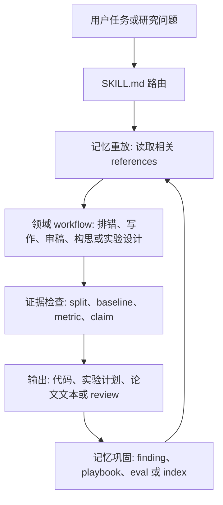

# NeuroFlow Agent

这是一个面向 AI x BCI 研究的持久工作流系统，用于让 agent 在多模态神经解码、EEG 视觉重建、扩散/生成模型、脑语言对齐、闭环脑调控、Physical AI 和 NeuroAI 项目中更像严谨的科研合作者。

仓库的核心思想不是“做一个简单的 AI 与脑机交叉 skill”，而是把 agent 在垂直科研场景中真正需要被定制的部分沉淀下来。Agent 通常由三部分组成：模型、工具和 workflow。模型和工具越来越像通用基础设施，唯独 workflow 需要根据具体研究领域、实验脆弱点、审稿标准和长期项目记忆来定制。因此，本仓库的目标是打造一个具有自进化、记忆重放和记忆巩固能力的 AI x BCI 持久工作流系统。

`SKILL.md` 只负责精简路由，`references/` 保存可重放的研究记忆和细分工作流，`scripts/` 保存确定性辅助脚本，`evals/` 保存行为评测 prompt，`docs/` 解释这些机制如何组织成一个可持续迭代的系统。

## 为什么核心是 Workflow

通用 coding agent 容易忽略 AI x BCI 项目的脆弱点：

- EEG split、重复试次、归一化、刺激 ID 对齐可能静默泄漏或错位。
- 生成式重建指标可能奖励尺度、采样或语义捷径，而不是神经信号对齐。
- diffusion denoising loss 看起来正常时，模型仍可能没有使用具体图像 condition。
- 论文 claim 必须区分 decoding、reconstruction、alignment 和 closed-loop modulation。

这些问题通常不是靠换一个更强的模型或者多接几个工具就能解决，而是要让 agent 遵循正确的科研操作顺序：先查 split 和 leakage，再看 baseline；先定位 target、normalization 和 metric，再讨论模型容量；先区分 offline decoding 和 online closed-loop，再写论文 claim。

这个仓库把这些 workflow 固化下来，让之后的 Codex 会话能从正确假设开始，并且能把新的实验经验回放、压缩、巩固到下一轮工作中。

## 持久工作流系统



这个系统希望每一次真实研究工作都能留下可复用的痕迹：失败模式变成 playbook，稳定结论变成 dated finding，常见审稿风险变成 reviewer objection，重要行为变成 eval。

## 核心能力

- **实验排错**：尺度检查、输出目录检查、train/val/test 定位、condition ablation、采样方差、评估协议对齐。
- **BCI 实验设计**：模态、split、预处理、baseline、metric、leakage、robustness。
- **论文和 rebuttal**：reviewer-facing claim、限制表述、venue checklist、审稿质疑应对。
- **研究记忆**：按日期沉淀实验结论、仓库笔记、论文定位和复现记录。
- **仓库感知执行**：先读本地代码，保护已有修改，围绕研究目标做最小必要改动。

## 仓库组织原则

- `skills/ai-bci-research/SKILL.md`：只放路由、first reads 和高层操作规则。
- `skills/ai-bci-research/references/`：放会改变未来 agent 行为的长期研究记忆。
- `docs/`：解释 workflow、playbook、demo 和验证方式。
- `skills/ai-bci-research/scripts/`：放确定性维护脚本，不放一次性实验脚本。
- `skills/ai-bci-research/evals/`：用 prompt 检查 agent 行为是否符合本仓库要求。

原始日志、checkpoint、数据集、大文件、隐私或人类被试相关材料不应该进入这个仓库。这里保存的是被压缩后的可复用经验。

## 安装

使用 Codex skill installer：

```bash
python3 ~/.codex/skills/.system/skill-installer/scripts/install-skill-from-github.py \
  --repo dongyangli-del/NeuroFlow-Agent \
  --path skills/ai-bci-research
```

手动安装：

```bash
git clone https://github.com/dongyangli-del/NeuroFlow-Agent.git
cd NeuroFlow-Agent
bash install.sh
```

安装后重启 Codex。

## 更新知识

添加论文、仓库笔记、数据集或实验结论后：

```bash
cd NeuroFlow-Agent/skills/ai-bci-research
python3 scripts/update_knowledge_index.py --root .
```

然后运行：

```bash
make validate
```

## 文档入口

- [Workflows](docs/WORKFLOWS.md)：核心研究工作流。
- [Playbook Catalog](docs/PLAYBOOKS.md)：排错和写作 playbook 索引。
- [Examples](docs/EXAMPLES.md)：真实 demo case 模板和待补案例。
- [Validation](docs/VALIDATION.md)：验证命令和质量检查。

## 明星项目方向

这个项目不应该变成泛科研笔记库，而应该成为最强的 AI x BCI research agent 持久工作流系统：窄、深、可验证、能真实避免实验和论文错误，并且能随着研究积累不断自我进化。
