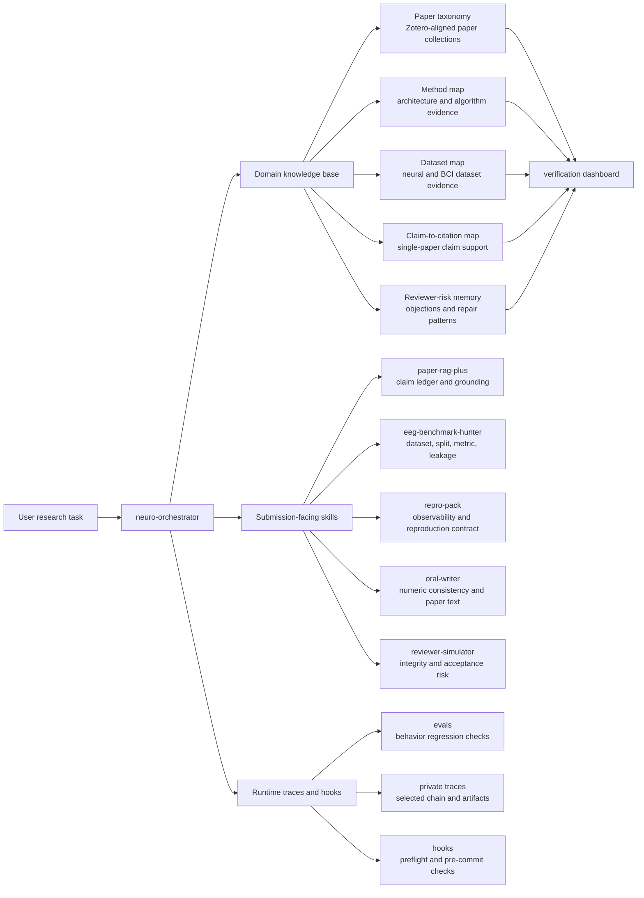

# Knowledge Graph

NeuroFlow keeps its public knowledge base as source-traced Markdown artifacts plus a lightweight searchable index. The goal is not to claim a fully reproduced paper database. The goal is to expose where each piece of workflow memory comes from, what it can safely support, and what still needs verification.

Use this page as the public entry point before opening large generated maps such as `paper-taxonomy.md`, `method-map.md`, or `claim-to-citation.md`.

## Taxonomy Graph



## Public Index Files

| Index | Use | Verification stance |
|---|---|---|
| [Paper taxonomy](../skills/paper-rag-plus/references/paper-taxonomy.md) | Browse papers by Zotero-aligned collection and task taxonomy. | Collection-aligned and source-traced; citation-critical use still requires paper inspection. |
| [Papers index summary](../skills/paper-rag-plus/references/papers-index-summary.md) | Read the public summary before opening large maps. | Public-safe rollup of current maps and unresolved fields. |
| [Method map](../skills/paper-rag-plus/references/method-map.md) | Find papers linked to methods such as contrastive learning, diffusion, transformers, or linear baselines. | Title/abstract/keyword evidence; missing cells remain unresolved. |
| [Dataset map](../skills/paper-rag-plus/references/dataset-map.md) | Find neural, BCI, EEG, fMRI, MEG, iEEG/ECoG, spike, and neuroimaging datasets. | Neural-dataset filtered; access routes and inappropriate-use notes may need manual verification. |
| [Claim-to-citation map](../skills/paper-rag-plus/references/claim-to-citation.md) | Map draft claims to candidate single-paper support and reviewer risks. | Retrieval memory, not final citation proof. |
| [Manual review queue](../skills/paper-rag-plus/references/manual-review-needed.md) | Inspect remaining unresolved citation-critical fields. | Needs human review for listed fields. |
| [Verification dashboard](VERIFICATION_DASHBOARD.md) | See verification status by knowledge category. | Public status dashboard for launch/readiness decisions. |

## Search

Use the runtime CLI to search the public knowledge graph without opening large Markdown files:

```bash
python3 scripts/neuroflow_runtime/cli.py kb search "cross-subject EEG"
python3 scripts/neuroflow_runtime/cli.py kb search "THINGS EEG visual reconstruction" --limit 5
python3 scripts/neuroflow_runtime/cli.py kb summary
```

Search returns file, line, heading, score, and a short snippet. It is a retrieval entry point, not a final evidence verdict.

## Verification Levels

| Level | Meaning | Safe use |
|---|---|---|
| `auto-imported` | Imported from Zotero/OpenAlex/BIB metadata. | Retrieval only. |
| `source-traced` | Matched to a trusted title/source URL or collection assignment. | Candidate support, still verify before citation-critical use. |
| `agent-source-traced` | Agent-assisted field extraction from trusted paper text or metadata. | Useful for workflow memory; not human-reviewed. |
| `needs_human_review` | Remaining unresolved or low-confidence citation-critical fields. | Do not use as final claim support. |
| `reproduced` | A documented command or analysis produced expected output. | Only for the reproduced target artifact. |

## Maintenance Rule

When a new paper, dataset, method, or claim-support memory is added, update the smallest durable artifact and keep the verification status visible. Do not promote a retrieval hit into a paper claim until the source span, evidence tier, and unresolved fields are explicit.
