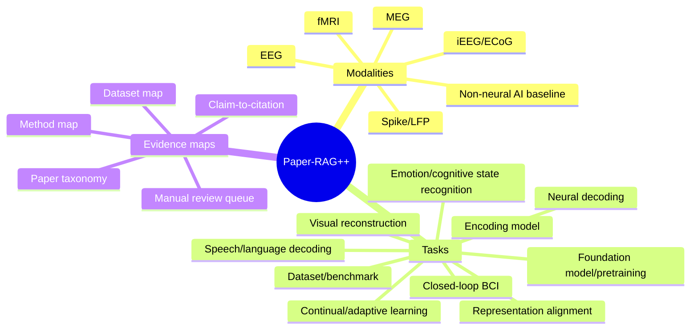

# Papers Index Summary

This is the public, lightweight entry point for the large Paper-RAG++ maps. Open this file before loading the full taxonomy or claim maps.

## Scope

Paper-RAG++ maintains retrieval memory for ML x BCI x neuroscience work:

- paper taxonomy by Zotero-aligned collection;
- method map for algorithms and architectures;
- dataset map for neural, BCI, EEG, fMRI, MEG, iEEG/ECoG, spike, and neuroimaging datasets;
- claim-to-citation map for single-paper claim support;
- manual-review queue for unresolved citation-critical fields.

## Current Public Counts

| Item | Count | Source |
|---|---:|---|
| Parsed papers | 1497 | `paper-taxonomy.md` |
| Papers with Zotero Collection assignments | 1497 | `paper-taxonomy.md` |
| Source-traced priority title matches | 177 | `source-verification-report.md` |
| Dropped failed public matches | 123 | `source-verification-report.md` |
| Remaining manual-review entries | 6 | `manual-review-needed.md` |
| Remaining unresolved DOI fields | 4 | `manual-review-needed.md` |
| Remaining unresolved limitation fields | 2 | `manual-review-needed.md` |

## Main Public Maps

| Map | What it answers | Evidence status |
|---|---|---|
| `paper-taxonomy.md` | Which papers are in each collection/task/method area? | Zotero collection-aligned, source-traced retrieval memory. |
| `method-map.md` | Which papers mention a method family or technical point? | Title/abstract/keyword evidence; unsupported fields remain unresolved. |
| `dataset-map.md` | Which neural or BCI datasets appear in the corpus? | Neural-dataset filtered metadata evidence. |
| `claim-to-citation.md` | Which paper may support a draft claim? | Single-paper metadata evidence; not consensus proof. |
| `manual-review-needed.md` | Which fields still need human verification? | Explicit `needs_human_review` queue. |

## High-Level Taxonomy



## Retrieval Contract

Use these maps to find candidates, not to write final claims directly.

Before a claim reaches paper text, verify:

- exact source span;
- modality, task, dataset, metric, and protocol fit;
- evidence tier and unresolved fields;
- citation fit and reviewer risk;
- whether the claim needs reproduction, benchmark, or statistical evidence.

## CLI

```bash
python3 scripts/neuroflow_runtime/cli.py kb search "cross-subject EEG"
python3 scripts/neuroflow_runtime/cli.py kb summary
```

## Related Public Docs

- [Knowledge graph entry point](../../../docs/KNOWLEDGE_GRAPH.md)
- [Verification dashboard](../../../docs/VERIFICATION_DASHBOARD.md)
